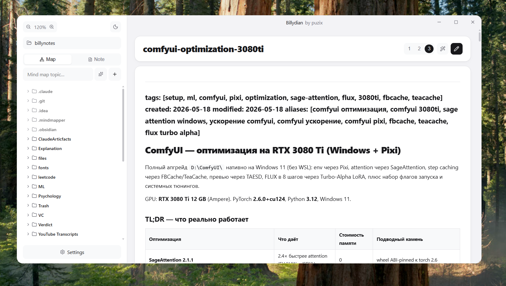
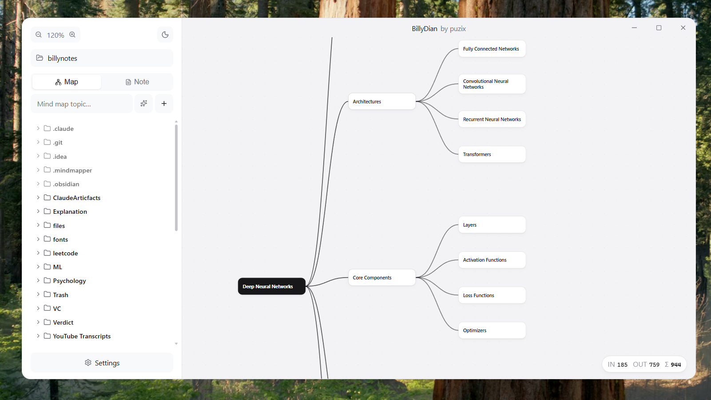

# Billydian

A vault-based desktop app for AI-assisted **notes** and **mind maps**, on
top of any model you can reach through OpenRouter. Pick a folder — it
becomes your vault. Markdown files render as notes (with KaTeX math),
`.mindmap` files open as interactive trees. Generate either by topic,
edit either by hand, and sync the whole vault to any S3-compatible
bucket.

Built with Tauri 2 + React 19 + d3-hierarchy + react-markdown.





## Features

- **Vault model.** Pick a folder; everything lives there as plain
  `.md` and `.mindmap` files plus a hidden `.mindmapper/` for settings.
  No proprietary DB.
- **AI generation.** Type a topic, get a full markdown note **or** a
  hierarchical mind map. Pick any OpenRouter model — type the slug
  yourself (`x-ai/grok-4`, `anthropic/claude-3.5-sonnet`, …).
- **Expand mind-map nodes.** Hover a node, click the sparkle, and the
  LLM grows 3-5 new sub-branches below it.
- **Markdown editor.** Single-pane view with an inline edit/view
  toggle — the title is editable in place, the body uses KaTeX for
  `$inline$` and `$$display$$` math. Width adjustable in three steps.
- **AI-generated titles.** Click the wand in the note header, the
  model reads the body and renames the file to a 3–7-word title.
- **Per-file tokens.** Small chip pinned to the canvas / note footer
  shows in/out/Σ token spend for the open document. No global counter
  cluttering the sidebar.
- **Smart S3 sync.** Two-way diff sync against any S3-compatible
  endpoint (AWS / MinIO / Cloudflare R2). Push/pull whichever side is
  newer, file by file. `.mindmapper/` is excluded so your creds never
  travel with the vault.
- **Frameless, themed, rebuilt-after-flov.** Rounded-card window,
  custom titlebar with min/max/close, dark + light themes, UI zoom
  (70 %–160 %) from the sidebar.

## Install

Grab the latest `Billydian_<version>_x64-setup.exe` from the
[Releases](https://github.com/reflaxess123/billydian/releases) page and
run it. Per-user install (no admin needed). Windows 10/11 x64.

You'll need an **OpenRouter API key** — paste it in Settings after
launch. Get one at [openrouter.ai](https://openrouter.ai).

## Develop

```bash
npm install
npm run tauri dev
```

## Build the installer locally

```powershell
.\scripts\build-installer.ps1
```

The .exe lands in `src-tauri/target/release/bundle/nsis/`.

## Release

```bash
git tag v0.2.0
git push origin v0.2.0
```

GitHub Actions builds the NSIS installer on `windows-latest` and
attaches it to a new GitHub Release automatically.
